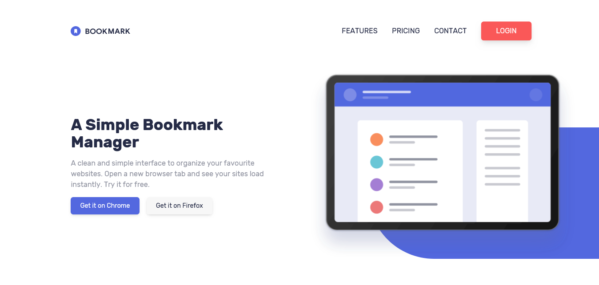

# Frontend Mentor - Bookmark landing page solution

This is a solution to the [Bookmark landing page challenge on Frontend Mentor](https://www.frontendmentor.io/challenges/bookmark-landing-page-5d0b588a9edda32581d29158). Frontend Mentor challenges help you improve your coding skills by building realistic projects.

## Table of contents

- [Overview](#overview)
  - [The challenge](#the-challenge)
  - [Screenshot](#screenshot)
  - [Links](#links)
- [My process](#my-process)
  - [Built with](#built-with)
  - [What I learned](#what-i-learned)
  - [Continued development](#continued-development)
  - [Useful resources](#useful-resources)
- [Author](#author)

## Overview

### The challenge

Users should be able to:

- View the optimal layout for the site depending on their device's screen size
- See hover states for all interactive elements on the page
- Receive an error message when the newsletter form is submitted if:
  - The input field is empty
  - The email address is not formatted correctly

### Screenshot

### Links

- Solution URL: [Add solution URL here](https://your-solution-url.com)
- Live Site URL: [Bookmark Landing Page](https://dinadess.github.io/bookmark-landing-page/)

## My process

### Built with

- Semantic HTML5 markup
- Flexbox
- CSS Grid
- [Tailwindcss](https://tailwindcss.com/) - CSS Framework
- Javascript

### What I learned

This project was a challenge for me to build accessible components as there were some common ones on the design : a tab section and an accordion for the FAQ.

- When I first discovered Tailwind CSS, I only used it to build SPAs with VueJS. But when I saw the design of the website, I found it a bit "Tailwindish" so I went for TailwindCSS as the styling framework instead of vanilla CSS. Doing so, I've learned to set up a full HTML project with Tailwind CSS and customize the config file with the viewport widths.

- I've also learned how to create an accessible tab section and I've struggled to find out how to write the JS code to make it responsive. For context, there's a marker to show the active tab and as the screen size goes from mobile to desktop and vice versa, the vertical alignment also changes. So, I had to write the code to make the cursor position itself on page load depending on the viewport width and also when the window is resized or when the phone orientation changes.

- Next thing I learned, though I've built some in the past is how to make an accessible accordion. Here, I've made use of the aria roles aria-expanded and aria-controls.

- Finally, I've learned how to make an animation on opening and closing the mobile navigation. The first solution I came up with was using the display property and was working fine, but as I wanted to create an animation on the menu and as the display property can not be animated, I had to resort to Kevin Powell's solution (see link below) by creating an intermediate state during which the animation was performed. Just after the animation is over (listened to the animationend event through an event listener), I have added the final state which implies setting the display property to none.

### Continued development

- I used regex to perform the form validation on the email input and I saw that there's still a lot to learn. So, I'll try to focus on it in future projects.

- Create a fullscreen navigation on mobile screens and adjust it to take up the max-content height when on landscape orientation, instead of cropping the nav.

### Useful resources

- [Build an accessible mobile menu | Kevin Powell on Youtube](https://www.youtube.com/watch?v=YAqRQoN8ykI) - Helped me create the animation when opening and closing the mobile menu along with the accessibility part as well.
- [ARIA Tab Role](https://developer.mozilla.org/en-US/docs/Web/Accessibility/ARIA/Roles/tab_role) - I used this MDN article to build the tab section.

## Author

- Frontend Mentor - [@dinadess](https://www.frontendmentor.io/profile/dinadess)
